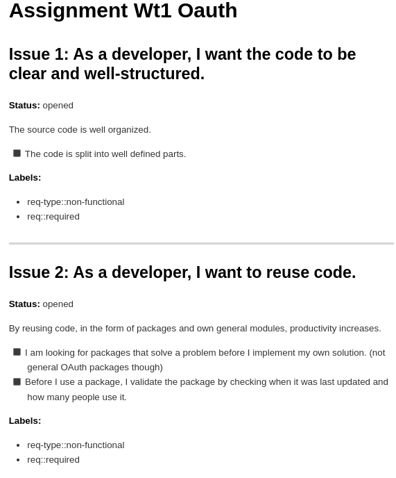
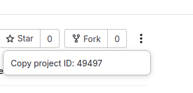

# Fetching LNU GitLab Issues via API

This guide provides instructions on how to fetch all issues from your LNU GitLab repository, including issue descriptions, using the GitLab API.

By getting a full list of issues, you can avoid having to manually check each issue in the GitLab interface. This can be useful to get an overview since some data might not be visible in the default view.

> ---
> **Example output:**
>
> 

## Prerequisites
- Python 3 installed.
- A GitLab **Personal Access Token (PAT)** with `read_api` scope.
- `curl` installed (pre-installed on most Linux/macOS systems).
- `jq` installed for formatting JSON output (optional but recommended).

## Setting Up a Personal Access Token (PAT)
1. Go to [GitLab LNU](https://gitlab.lnu.se/).
2. Click on your **Profile Picture** → **Edit Profile** → **Access Tokens**.
3. Create a new token with **read_api** scope.
4. Copy and save the token securely (you won’t be able to see it again).

**Note:** The `read_api` scope allows access to more than just issues. You can use it to retrieve various project-related information, such as merge requests, pipelines, and more.

## Setting up the Script with `.env` and Virtual Environment

To keep credentials and dependencies clean, this project uses a `.env` file and a local virtual environment.

### 1. Clone and enter the project directory:
```sh
git clone <your-repo-url>
cd <your-project-directory>
```

### 2. Create a `.env` file from the provided example:
```sh
cp .env.example .env
```
Edit `.env` with your actual token and project ID:
```
GITLAB_TOKEN=your_personal_access_token
GITLAB_PROJECT_ID=your_project_id
```

### 3. Create and activate a virtual environment:
```sh
python3 -m venv .venv
source .venv/bin/activate  # On Windows: .venv\Scripts\activate
```

### 4. Install required dependencies:
```sh
pip install -r requirements.txt
```

> If `requirements.txt` is missing, install manually:
> ```sh
> pip install requests python-dotenv
> ```

## Running the Script
To fetch issues from a project, use the following command:

```sh
python3 get-issues.py
```

To save the output to issues.md, use:

```sh
python3 get-issues.py > issues.md
```

## Finding Your Project ID

Your GitLab **Project ID** is a numeric identifier, not the project name.

You can get the project ID in different ways, depending on your preference:

### Option 1: Fetch a Particular Project's ID through the Web Interface
1. Go to your project in GitLab.
2. Click the three dots on the top right corner.
3. Copy the project ID



### Option 2: Fetch Your Accessible Projects' IDs
Run the following command to list all accessible project IDs along with their name, description, and web URL:

```sh
curl --header "PRIVATE-TOKEN: YOUR_ACCESS_TOKEN" \
     "https://gitlab.lnu.se/api/v4/projects?membership=true&simple=true" | jq '.[] | {id, name, name_with_namespace, description, web_url}'
```

This will return a list of projects in the following format:

```json
{
  "id": 12345,
  "name": "Assignment Wt1 Oauth",
  "name_with_namespace": "Webben som applikationsplattform (1DV027) / Student Projects / abxxxcd / Assignment Wt1 Oauth",
  "description": "Some description here...",
  "web_url": "https://gitlab.lnu.se/1dv027/student/abxxxcd/assignment-wt1-oauth"
}
```

## Additional Context: Fetching Issues with curl
If you want to retrieve issue data manually using `curl`, you can use the following command. However, note that the provided Python script already automates this process.

Replace `PROJECT_ID` with your numeric Project ID and run:

```sh
curl --header "PRIVATE-TOKEN: YOUR_ACCESS_TOKEN" \
     "https://gitlab.lnu.se/api/v4/projects/PROJECT_ID/issues?per_page=100" \
     -o issues.json
```

### Extracting Titles & Descriptions
To format and extract issue titles and descriptions:

```sh
jq '[.[] | {title: .title, description: .description}]' issues.json > formatted_issues.json
```

### Other Available Object Properties
Each issue object contains multiple properties. Some useful ones:

- `id` → Issue ID
- `title` → Issue title
- `description` → Full description of the issue
- `state` → Issue state (open/closed)
- `labels` → Labels assigned to the issue
- `created_at` → Date issue was created
- `updated_at` → Date issue was last updated
- `assignee` → User assigned to the issue (if any)
- `milestone` → Associated milestone (if any)
